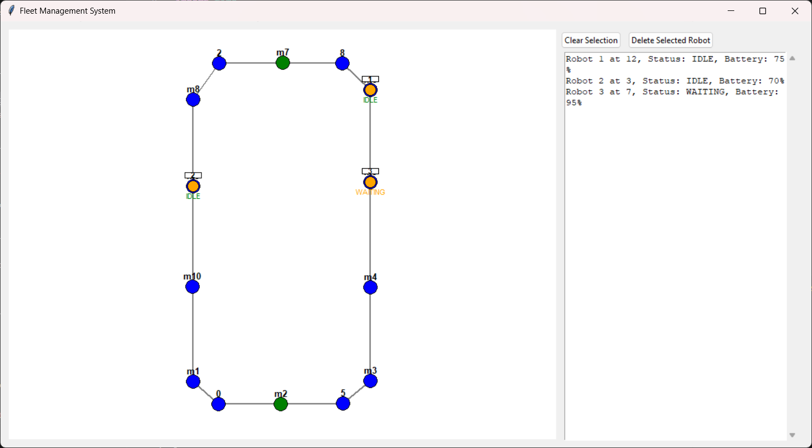
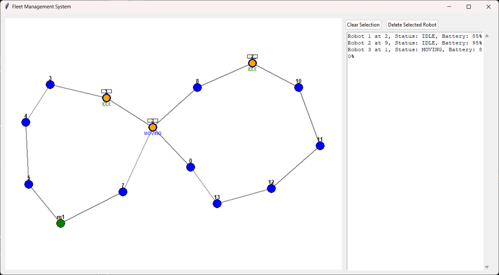
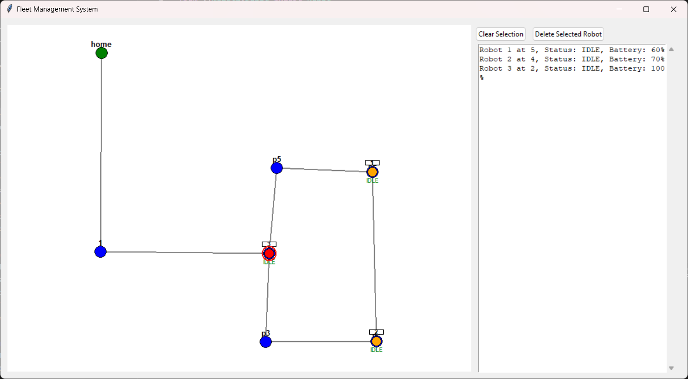

# Robot Fleet Management System

A simple Python GUI application for managing multiple robots navigating through a network of nodes. The system allows you to spawn robots, assign tasks, and monitor their movements in real-time.

## Features

- Visual display of navigation graph with nodes and edges
- Click to spawn robots at any node
- Click to assign tasks to robots
- Real-time robot movement and status updates
- Battery management and charging stations
- Collision avoidance between robots
- Status panel showing all robot information

## Quick Start

1. Install Python 3.8 or higher

2. Clone and run:
```bash
git clone https://github.com/lakshmanpanda/Robot-Fleet-Management-System.git
cd Robot-Fleet-Management-System

```

3. Create a virtual environment (recommended):
```bash
# Windows
python -m venv venv
venv\Scripts\activate
```

4. Install required packages:
```bash
pip install -r requirements.txt
```

5. Run:
```bash
python -m src.main data/nav_graph_1.json or
python -m src.main data/nav_graph_2.json or
python -m src.main data/nav_graph_3.json
```


## Demo Video Link

- [Demo Video link](https://drive.google.com/file/d/1bJ4uw8MDrsfQQW6pYjqhWXmGtiVLkA69/view?usp=sharing)

  
## Navigation Graphs

### Navigation Graph 1


### Navigation Graph 2


### Navigation Graph 3


## How to Use

1. **Add Robot**: Click on any node to spawn a robot
2. **Select Robot**: Click on a robot to select it (turns red)
3. **Assign Task**: Click on a destination node to send the robot there
4. **Clear Selection**: Click "Clear Selection" button
5. **Delete Robot**: Select a robot and click "Delete Selected Robot"

## Robot Status Colors
- Green: IDLE
- Blue: MOVING
- Orange: WAITING
- Purple: CHARGING

## Project Files
```
fleet_management_system/
├── data/
│ └── nav_graph.json
├── src/
│ ├── models/
│ │ ├── nav_graph.py # Parsing and representing nav_graph
│ │ └── robot.py # Robot behaviors and attributes
│ ├── controllers/
│ │ ├── fleet_manager.py # Robot task and state management
│ │ └── traffic_manager.py # Traffic negotiation and collision
handling
│ ├── gui/
│ │ └── fleet_gui.py # Interactive visualization
(Tkinter/PyQt/Pygame)
│ ├── utils/
│ │ └── helpers.py # Supporting functions (path algorithms,
etc.)
│ ├── logs/
│ │ └── fleet_logs.txt
│ └── main.py # Application entry point
├── requirements.txt
└── README.md
```

## Acknowledgments

- Dijkstra's algorithm implementation for path planning
- Tkinter for the graphical user interface
